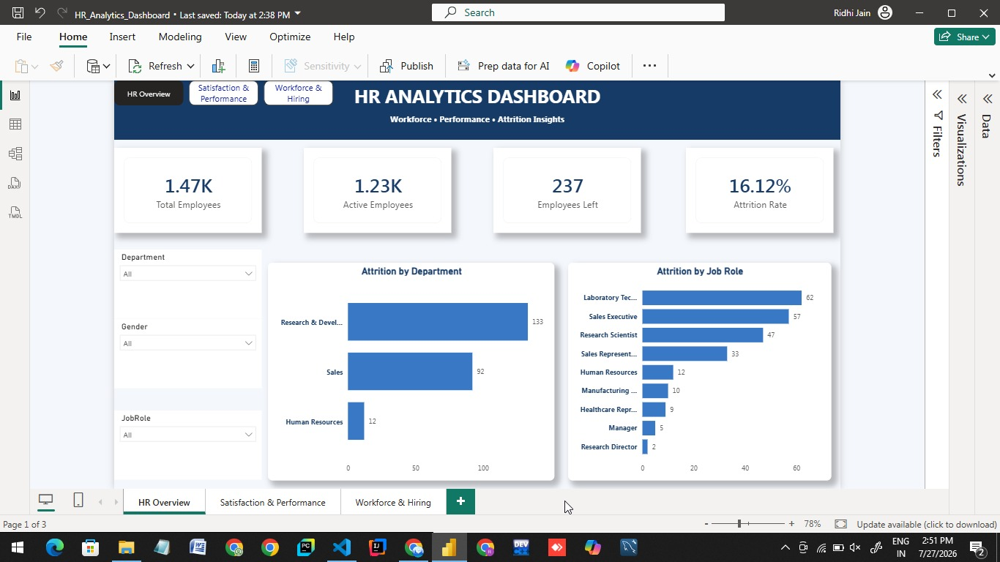
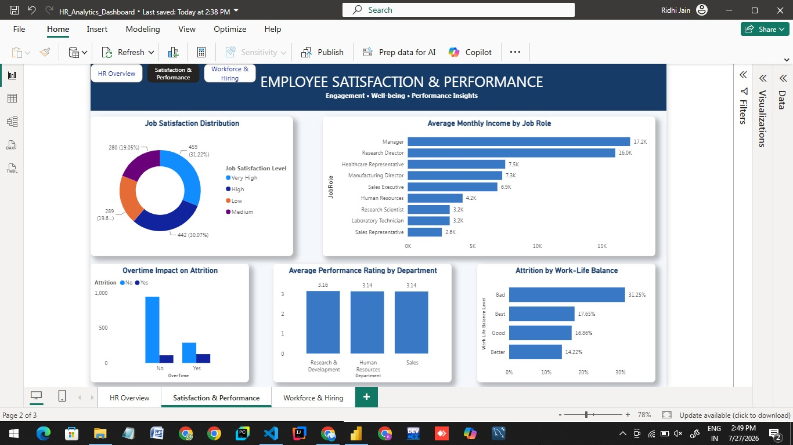
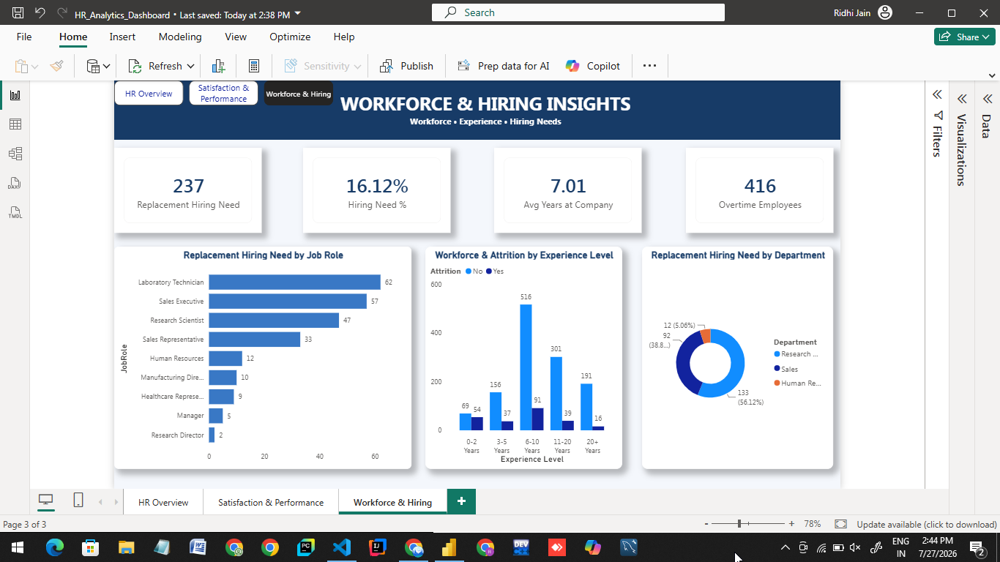

# HR Analytics Dashboard

## Project Overview

This project is an interactive **HR Analytics Dashboard developed using Microsoft Power BI** to analyze employee data and generate meaningful workforce insights.

The dashboard focuses on employee attrition, workforce composition, job satisfaction, performance, work-life balance, overtime, compensation, and replacement hiring requirements.

The report is divided into three interactive pages:

1. HR Overview
2. Employee Satisfaction & Performance
3. Workforce & Hiring Insights

---

## Project Objectives

The main objectives of this project are to:

- Analyze overall employee attrition.
- Identify departments and job roles with higher employee exits.
- Analyze employee satisfaction and work-life balance.
- Compare employee performance across departments.
- Study the relationship between overtime and attrition.
- Analyze average monthly income across job roles.
- Understand workforce distribution based on experience.
- Estimate replacement hiring requirements based on employee attrition.
- Build an interactive Power BI report for HR decision-making.

---

## Dashboard Pages

### 1. HR Overview

The HR Overview page provides a high-level summary of the organization's workforce.

### Key KPIs

- **Total Employees:** 1.47K
- **Active Employees:** 1.23K
- **Employees Left:** 237
- **Attrition Rate:** 16.12%

### Visualizations

- Attrition by Department
- Attrition by Job Role
- Department Slicer
- Gender Slicer
- Job Role Slicer



---

### 2. Employee Satisfaction & Performance

This page focuses on employee engagement, satisfaction, compensation, performance, overtime, and work-life balance.

### Visualizations

- Job Satisfaction Distribution
- Average Monthly Income by Job Role
- Overtime Impact on Attrition
- Average Performance Rating by Department
- Attrition Rate by Work-Life Balance



---

### 3. Workforce & Hiring Insights

This page focuses on workforce planning and replacement hiring requirements.

### Key KPIs

- **Replacement Hiring Need:** 237
- **Hiring Need Percentage:** 16.12%
- **Average Years at Company:** 7.01
- **Overtime Employees:** 416

### Visualizations

- Replacement Hiring Need by Job Role
- Workforce & Attrition by Experience Level
- Replacement Hiring Need by Department

The replacement hiring requirement is estimated using employee attrition. It represents the number of replacement hires required to restore the workforce to its original headcount.



---

## Key Insights

- The organization has **1,470 employees**, of which **237 employees have left**.
- The overall employee attrition rate is **16.12%**.
- **Research & Development** recorded the highest number of employee exits with **133 employees**, followed by **Sales with 92**.
- **Laboratory Technicians** have the highest replacement hiring requirement with **62 employees**.
- **Sales Executives** have the second-highest replacement requirement with **57 employees**.
- **Research Scientists** recorded **47 employee exits**.
- Job satisfaction is distributed across Low, Medium, High, and Very High satisfaction levels.
- Average performance ratings are very similar across departments.
- Overtime and employee attrition can be interactively analyzed through the dashboard.
- Experience-level analysis helps identify how employee attrition is distributed across different workforce experience groups.

---

## DAX Measures

Some of the key DAX measures created for this project include:

```DAX
Total Employees =
COUNTROWS('WA_Fn-UseC_-HR-Employee-Attrition')

Employees Left =
CALCULATE(
    COUNTROWS('WA_Fn-UseC_-HR-Employee-Attrition'),
    'WA_Fn-UseC_-HR-Employee-Attrition'[Attrition] = "Yes"
)

Active Employees =
[Total Employees] - [Employees Left]

Attrition Rate =
DIVIDE(
    [Employees Left],
    [Total Employees],
    0
)

Replacement Hiring Need =
[Employees Left]

Hiring Need % =
DIVIDE(
    [Replacement Hiring Need],
    [Total Employees],
    0
)
```

---

## Tools & Technologies

- Microsoft Power BI Desktop
- Power Query
- DAX (Data Analysis Expressions)
- Data Cleaning & Transformation
- Data Visualization
- GitHub

---

## Interactive Features

The dashboard includes:

- Interactive slicers
- Cross-filtering between visuals
- Department filtering
- Gender filtering
- Job Role filtering
- Synced slicers across report pages
- Page navigation buttons
- Interactive KPI cards and charts

---

## Project Structure

```text
HR-Analytics-Dashboard/
│
├── Screenshots/
│   ├── HR-Overview.png
│   ├── Satisfaction.png
│   └── workforce.png
│
├── HR_Analytics_Dashboard.pbix
└── README.md
```

---

## Conclusion

This HR Analytics Dashboard transforms employee data into interactive workforce insights using Power BI.

The dashboard helps analyze employee attrition, satisfaction, performance, compensation, overtime, experience, and replacement hiring requirements. It provides HR teams with an interactive way to explore workforce trends and identify areas that may require attention.

---

## Internship Project

This project was developed as part of the **CodeAlpha Power BI Internship – HR Analytics Task**.
